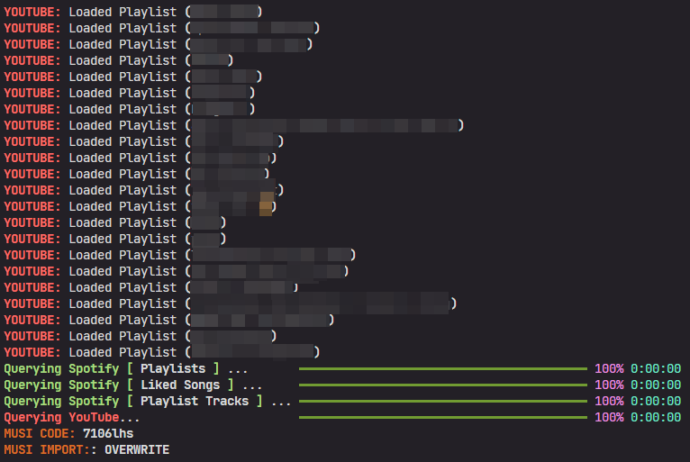
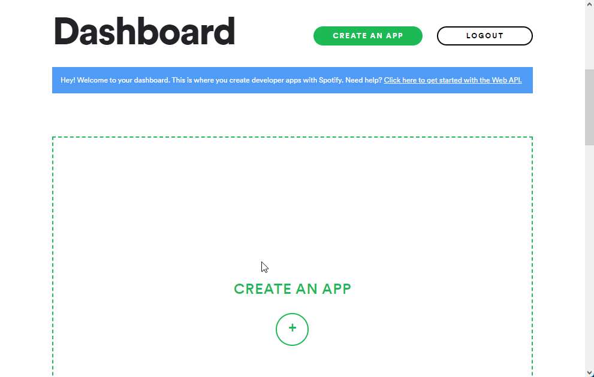
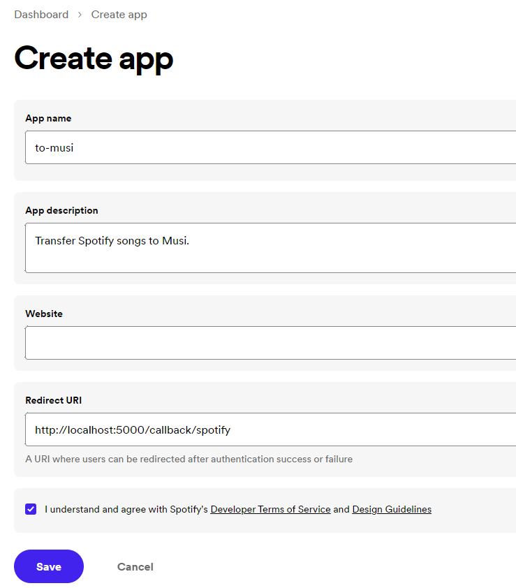
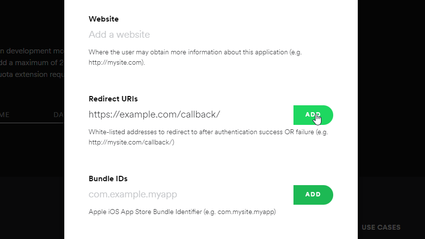
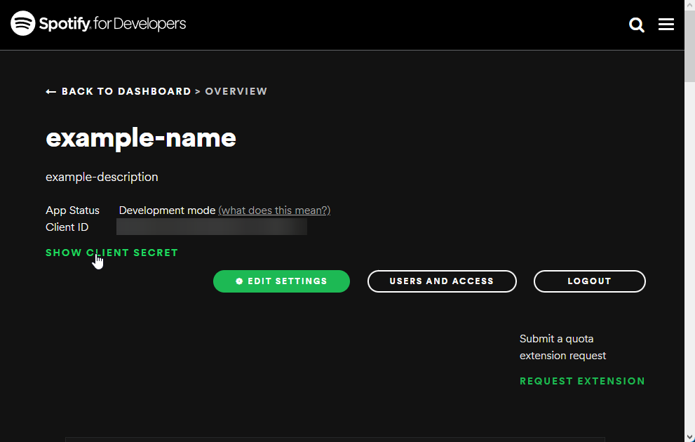
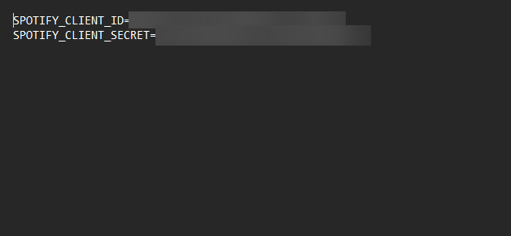
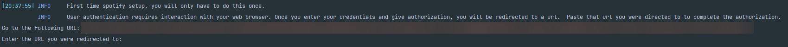
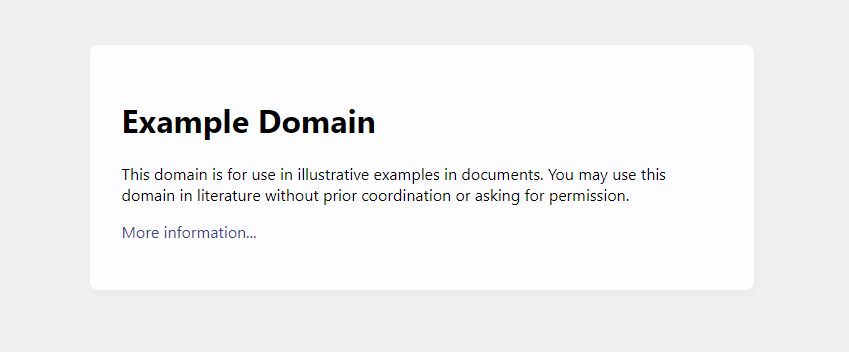

# spotify-to-musi

> Transfer your [Spotify](https://spotify.com) playlists to [Musi](https://feelthemusi.com).

# Why Musi?

Musi allows you to listen to any song (video) from YouTube without being interrupted with ads like with Spotify.
As someone who doesn't have a music streaming subscription I prefer to use Spotify on Desktop and Musi on mobile,
so I created this app to transfer songs between the two.

# Spotify API

1. Go to https://developer.spotify.com/dashboard/ \
   
2. Choose an app name and accept the terms and conditions. \
   
3. Set callback to http://localhost:5000/callback/spotify \
   
4. View Client ID and Client Secret \
   
5. Rename .env.example to .env and set secrets \
   
6. Upon running the script for the first time, you will be prompted with something that looks like this: \
   
7. Click the URL, Sign In if you need to and proceed until you see a page that looks like this: \
   
8. Copy the URL of the page you were redirected to and paste it into the console of the program and enter

# PyCharm Usage

If you're running pycharm, make sure `emulate terminal in output console` is enabled 

references:

- https://youtrack.jetbrains.com/issue/PY-43860
- https://rich.readthedocs.io/en/latest/introductin.html
