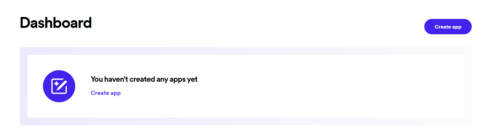

# spotify-to-musi

> Transfer your [Spotify](https://spotify.com) playlists to [Musi](https://feelthemusi.com).

# Why Musi?

Musi allows you to listen to any song (video) from YouTube without being interrupted with ads like with Spotify.
As someone who doesn't have a music streaming subscription I prefer to use Spotify on Desktop and Musi on mobile,
so I created this app to transfer songs between the two.

# Spotify Credentials Setup

1. Navigate to https://developer.spotify.com/dashboard \
   
2. Create an app with the name & description of your choice.
   Make sure the callback URL is set to http://localhost:5000/callback/spotify \
   
3. Open Settings \
    
4. View Client ID and Client Secret and store them in a safe place. \
   
5. Initialize setup script with `spotify-to-musi setup` & enter Client ID and Client Secret \
   
6. Open the link (http://localhost:5000/callback/spotify) in your browser and authorize with Spotify \
   
7. Return to your terminal, and you should be successfully authorized! :3 \
    

# PyCharm Usage

If you're running pycharm, make sure `emulate terminal in output console` is enabled 

references:

- https://youtrack.jetbrains.com/issue/PY-43860
- https://rich.readthedocs.io/en/latest/introductin.html
